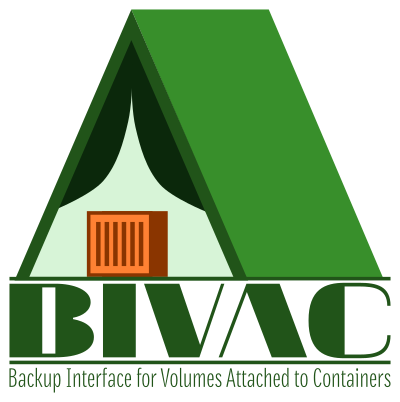

Bivac : Backup Interface for Volumes Attached to Containers
===========================================================

Website: [https://camptocamp.github.io/bivac](https://camptocamp.github.io/bivac)


[](https://hub.docker.com/r/camptocamp/bivac/)
[](https://travis-ci.org/camptocamp/bivac)
[](https://coveralls.io/r/camptocamp/bivac?branch=master)
[](https://goreportcard.com/report/github.com/camptocamp/bivac)
[](https://gitter.im/camptocamp/bivac)
[](http://www.camptocamp.com)


Bivac lets you backup all your containers volumes deployed on Docker Engine, Cattle or Kubernetes using Restic.




## Installing

```shell
$ go get github.com/camptocamp/bivac
```

## Usage

```shell
Usage:
  bivac manager [flags]

Flags:
      --cattle.accesskey string                   The Cattle access key. [CATTLE_ACCESS_KEY]
      --cattle.secretkey string                   The Cattle secret key. [CATTLE_SECRET_KEY]
      --cattle.url string                         The Cattle URL. [CATTLE_URL]
      --docker.endpoint string                    Docker endpoint. [BIVAC_DOCKER_ENDPOINT] (default "unix:///var/run/docker.sock")
  -h, --help                                      help for manager
      --kubernetes.agent-service-account string   Specify service account for agents. [KUBERNETES_AGENT_SERVICE_ACCOUNT]
      --kubernetes.all-namespaces                 Backup volumes of all namespaces. [KUBERNETES_ALL_NAMESPACES]
      --kubernetes.kubeconfig string              Path to your kuberconfig file. [KUBERNETES_KUBECONFIG]
      --kubernetes.namespace string               Namespace where you want to run Bivac. [KUBERNETES_NAMESPACE]
      --log.server string                         Manager's API address that will receive logs from agents. [BIVAC_LOG_SERVER]
  -o, --orchestrator string                       Orchestrator on which Bivac should connect to. [BIVAC_ORCHESTRATOR]
      --providers.config string                   Configuration file for providers. [BIVAC_PROVIDERS_CONFIG] (default "/providers-config.default.toml")
      --restic.forget.args string                 Restic forget arguments. [RESTIC_FORGET_ARGS] (default "--keep-daily 15 --prune")
      --retry.count int                           Retry to backup the volume if something goes wrong with Bivac. [BIVAC_RETRY_COUNT]
      --server.address string                     Address to bind on. [BIVAC_SERVER_ADDRESS] (default "0.0.0.0:8182")
      --server.psk string                         Pre-shared key. [BIVAC_SERVER_PSK]
  -r, --target.url string                         The target URL to push the backups to. [BIVAC_TARGET_URL]

Global Flags:
  -b, --blacklist string   Do not backup blacklisted volumes. [BIVAC_VOLUMES_BLACKLIST]
  -v, --verbose            Enable verbose output [BIVAC_VERBOSE]
  -w, --whitelist string   Only backup whitelisted volumes. [BIVAC_VOLUMES_WHITELIST]
```

## Examples

### Backup all named volumes to S3 using Restic

```shell
$ RESTIC_PASSWORD=<my_restic_password> AWS_ACCESS_KEY_ID=<my_key_id> AWS_SECRET_ACCESS_KEY=<my_secret_key> \
  bivac \
  -o docker \
  -r s3:s3.amazonaws.com/<my_bucket>/<my_dir> \
```

### Using docker

```shell
$ docker run -v /var/run/docker.sock:/var/run/docker.sock:ro  --rm -ti \
   -e BIVAC_TARGET_URL=s3:s3.amazonaws.com/<my_bucket>/<my_dir> \
   -e AWS_ACCESS_KEY_ID=<my_key_id> \
   -e AWS_SECRET_ACCESS_KEY=<my_secret_key> \
   -e RESTIC_PASSWORD=<my_restic_password> \
     camptocamp/bivac
```

## Orchestrators

Bivac supports running on either Docker Engine (using the Docker API), Kubernetes (using the Kubernetes API) or Rancher Cattle (using the Cattle API).

### Docker

Bivac will backup all named volumes by default.

### Kubernetes

Bivac will backup all Persistent Volume Claims by default.

### Cattle

Bivac will backup all Volumes by default.

## Providers

Bivac detects automatically the kind of data that is stored on a volume and adapts its backup strategy to it. The following providers and associated strategies are currently supported:

* PostgreSQL: Run `pg_dumpall` before backup
* MySQL: Run `mysqldump` before backup
* OpenLDAP: Run `slapcat` before backup
* Default: Backup volume data as is
